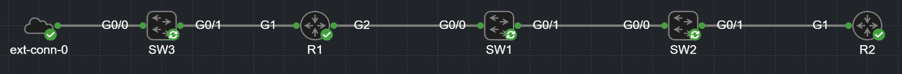
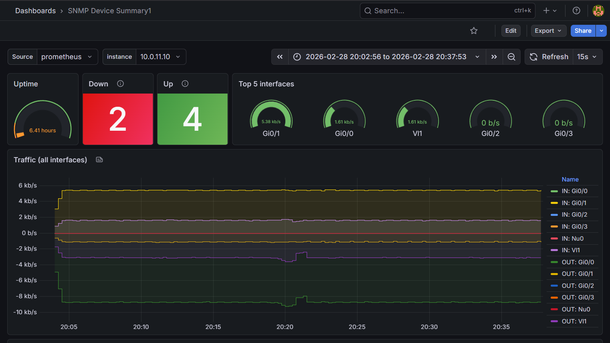

# 🌐 NetDevOps: Autonomous Self-Healing Infrastructure with Real-Time Observability

## 🚀 Executive Summary
This project demonstrates a production-grade **NetDevOps** ecosystem designed to eliminate manual configuration errors and guarantee 100% network consistency. By adopting an **Infrastructure as Code (IaC)** approach, the platform implements a **Closed-Loop Automation** cycle that autonomously detects, reports, and remediates unauthorized configuration changes (Configuration Drift) while providing deep visibility through a modern observability stack.

---

## 🏗 System Architecture
The platform integrates five critical layers of modern infrastructure management:

1.  **Source of Truth (NetBox):** The authoritative data store for all network intent (IP addressing, device roles, site metadata).
2.  **Automation Engine (Ansible):** Orchestrates idempotent state enforcement using custom dynamic inventory mapping.
3.  **GitOps Pipeline (GitHub Actions):** Manages the full CI/CD lifecycle, triggering validation and deployment on every commit.
4.  **Real-Time Observability (Prometheus & Grafana):** Monitors network health, interface traffic, and OSPF states via SNMP.
5.  **Edge Intelligence (Cisco EEM):** On-box event-driven scripts providing a final layer of autonomous defense (Dead Man's Switch).

---

## 📸 Proof of Concept (Lab Preview)
*Below are real-world captures from the running environment.*

### 🛠 Network Topology (Cisco CML)

*Figure 1: The physical layout of the lab consisting of multi-tier Cisco routers and switches.*

### 📊 Monitoring Dashboard (Grafana)

*Figure 2: Real-time telemetry showing interface throughput and device health metrics.*

---

## 🔥 Key Technical Capabilities

### 1. Dynamic SSoT-Driven Inventory
A custom Python-based engine interfaces directly with the NetBox API. Any change in NetBox intent is instantly reflected across the entire automation surface without manual code updates.

### 2. Autonomous Drift Remediation
The system continuously monitors the running configuration. It instantly identifies unauthorized manual overrides (e.g., removal of OSPF) and automatically re-provisions the required state.

### 3. Network Observability (New!)
Integrated **Prometheus** and **SNMP Exporter** pull telemetry from Cisco devices every 15 seconds. **Grafana** visualizes this data, allowing for instant detection of performance bottlenecks or link failures.

### 4. Fail-Safe "Dead Man's Switch" (Cisco EEM)
If connectivity to the automation server is lost for 60 seconds, the device autonomously triggers a **rollback to the last-known-good configuration** (`startup-config`), ensuring the infrastructure remains reachable for remediation.

### 5. Cloud Infrastructure as Code (Terraform)
The entire automation server, including Docker, NetBox, and the observability stack, can be spun up from scratch in the cloud (AWS) using the provided Terraform blueprints. This ensures the environment is fully disposable, scalable, and immutable.

---

## 🛠 Tech Stack
*   **Networking:** Cisco IOS (CML-based Lab)
*   **Cloud IaC:** Terraform (AWS EC2, Security Groups)
*   **SSoT:** NetBox (Containerized)
*   **Observability:** Prometheus, Grafana, SNMP Exporter
*   **Orchestration:** Ansible (cisco.ios collection)
*   **CI/CD:** GitHub Actions with Self-Hosted Runners

---

## 📈 Strategic Value
*   **Zero-Deviation Compliance:** The live network is always a 1:1 reflection of documentation.
*   **Extreme Resilience:** Minimizes MTTR through autonomous edge-based healing.
*   **Data-Driven Decisions:** Real-time metrics allow for proactive capacity planning and troubleshooting.

---
*Authored as a comprehensive demonstration of Advanced Network Automation and DevOps Engineering.*
